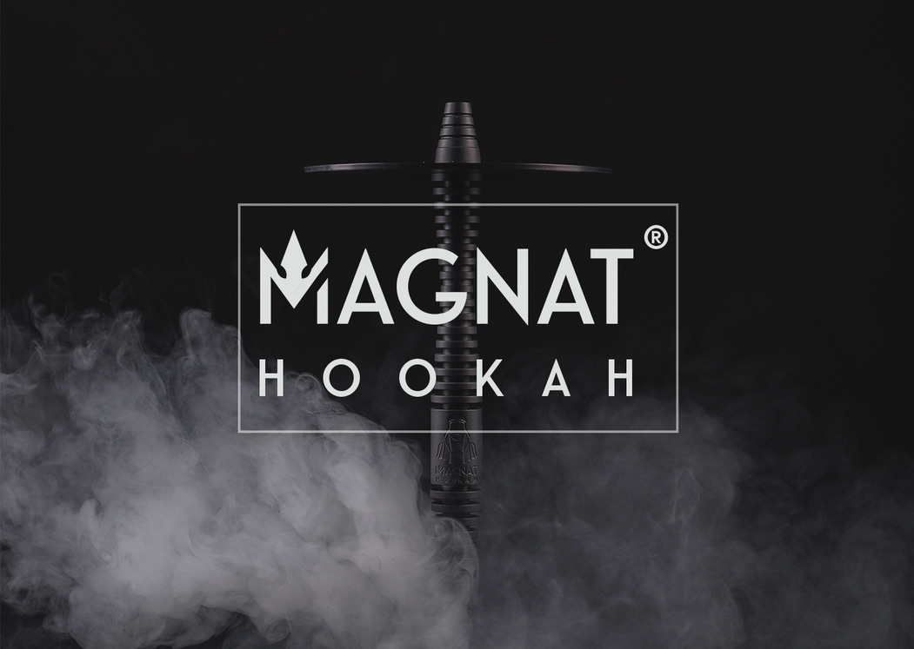

# MAGNAT Hookah
#### - Hookah as a new status symbol. -

___

### EN

Magnat Hookahs are individual innovations combined with a unique design. The main and rare advantage of Magnat hookahs, thanks to which we differ from all hookahs of this price category, is a base that rotates smoothly 360 degrees, in which the shaft with a saucer and the flask remain motionless. This method allows you to pass the hose to the partner in a more convenient way, avoiding the rocking of the hookah, in which in most cases smokers drop the coals. The material of hookahs is made of durable aviation aluminum, which is anodized to create a protective film on the metal surface at the molecular level. A stainless food tube passes through the shaft, which has a radiator design. The ports for the connector and the blow valve are pressed with neodymium magnets and can be replaced with special connectors for the simultaneous use of two hoses. Soft-touch coated hoses are of good quality, do not bend and are very pleasant to the touch. The screw-in diffuser allows you to smoke hookah softer and quieter. There is the possibility of specialized branding of the model under the name of a hookah network or different establishments by milling, which gives a three-dimensional look to your logo or name.

***Description:***

- Shaft length - 630 mm.
- The depth of the lower part of the shaft entering the flask is 190 mm.
- Weight (without flask) - 1.6 kg.
- Flask diameter (standard) - 45 mm.
- Saucer diameter - 190 mm.

___

### RU

Кальяны Магнат - это  индивидуальные инновации совмещённые с уникальным дизайном. Главным и редким преимуществом кальянов Магнат благодаря которому мы отличаемся от всех кальянов этой ценовой категории - это плавно вращающаяся на 360 градусов основание, при котором шахта с блюдцей  и колба остаются неподвижными. Этот способ позволяет более удобным способом передать шланг партнёру, избегая раскачивание кальяна, при котором в большинстве случаев курильщики роняют угли. Материал кальянов сделан из прочного авиационного алюминия, которая анодируется для создания на поверхности металла защитной плёнки на молекулярном уровне. Через шахту, имеющую дизайн радиатора , проходит пищевая нержавеющая трубка. Порты для коннектора и выдувного клапана, пижимаются неодимовыми магнитами и могут быть заменены на специальные коннекторы для одновременного использования двух шлангов.Шланги с покрытием Soft-touch имеют хорошее качество, не гнутся и очень приятны на ощупь. Вкручиваемый диффузор позволяет курить кальян более мягким и бесшумным. Имеется возможность специализированного брендинга модели под название кальянной сети или разных заведений путём фрезерования, которй даёт объёмный вид вашему логотипу или имени.

***Описание:***

- Длина шахты - 630 мм.
- Глубина нижней части шахты входящего в колбу 190 мм.
- Вес (без колбы) - 1,6 кг.
- Диаметр колбы (стандартный) - 45 мм.
- Диаметр блюдца - 190 мм.